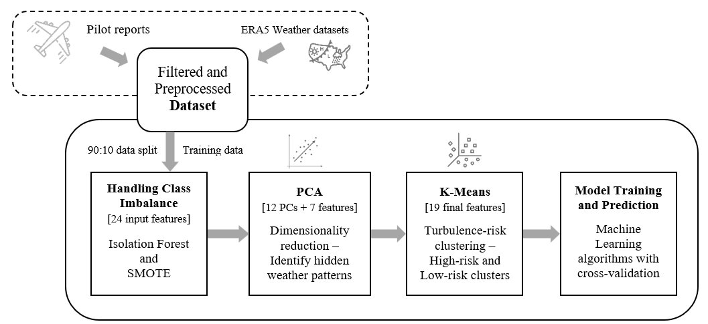
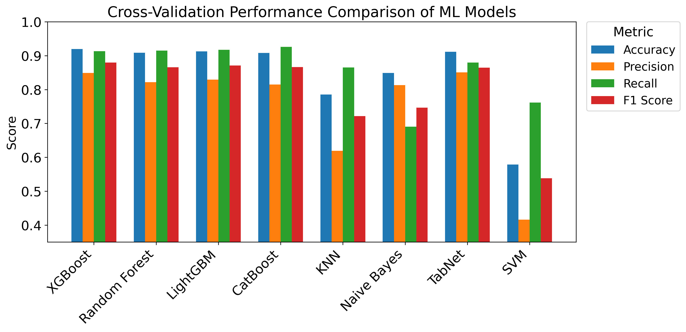
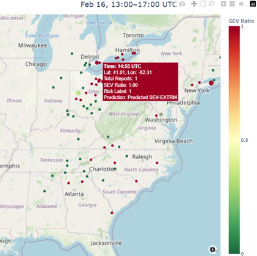

# Machine Learning for Turbulence Risk Prediction in U.S. Airspace Using Open Flight and Weather Data

**Graduate Project by [Godha Naravara](https://github.com/godhanaravara)**  
**Repository:** `aviation-turbulence-risk-predictor-ML`

---

## ▸ Problem Statement

Turbulence, especially clear-air turbulence (CAT), remains a serious challenge for aviation safety, often arising unexpectedly and outside the reach of radar-based forecasting systems. This project aims to **predict high-risk turbulence events** using open datasets from aviation reports and atmospheric reanalysis sources, thereby providing a data-driven alternative to traditional physics-based forecasting methods.

The work draws inspiration from the approach introduced by [Mizuno et al. (2022)](https://journalofbigdata.springeropen.com/articles/10.1186/s40537-022-00584-5), who demonstrated the potential of [machine learning based turbulence risk prediction](https://github.com/smzn/Turbulence) near Japanese airports. Their open-source implementation helped guide early exploration, though this project significantly extends the scope by applying the methodology at a national scale using U.S. PIREPs and ERA5 data.

---

## [Data Sources & Collection](https://github.com/godhanaravara/aviation-turbulence-risk-predictor-ML/blob/main/01-Data-collection/01-data-sources-and-acquisition.ipynb)

- **PIREPs** (Pilot Reports)
  From the Iowa Environmental Mesonet to real-time turbulence observations from pilots.

- **ERA5 Reanalysis**  
  Hourly pressure-level atmospheric data (28 levels) from Copernicus CDS, with over 1.5 TB downloaded for 2024.  
  Variables included: wind speed, shear, cloud content, vorticity, geopotential, humidity, and more.

---

## ▸ ML Pipeline Overview

**Pipeline Overview figure**

- [**Data Cleaning & Merging**](https://github.com/godhanaravara/aviation-turbulence-risk-predictor-ML/blob/main/02-Preprocessing-and-Feature-engineering/02-pirep-cleaning-and-matching.ipynb)
  - Matched PIREPs with ERA5 based on location, time, and altitude (hPa)
- [**Feature Engineering**](https://github.com/godhanaravara/aviation-turbulence-risk-predictor-ML/blob/main/02-Preprocessing-and-Feature-engineering/03-feature-engineering.ipynb)
  - Derived features like wind shear, vertical velocity, cloud water content, etc.
- [**Class Balancing**](https://github.com/godhanaravara/aviation-turbulence-risk-predictor-ML/blob/main/03-Class-balancing/04-class-balancing.ipynb)
  - ⤷ Isolation Forest: Downsampled the majority "NEG" turbulence class based on anomaly scores  
  -  ⤷ SMOTE: Oversampled the critical "SEV–EXTRM" turbulence cases
- [**Dimensionality Reduction](https://github.com/godhanaravara/aviation-turbulence-risk-predictor-ML/blob/main/04-Unsupervised-learning/05-pca-analysis.ipynb) + [Clustering**](https://github.com/godhanaravara/aviation-turbulence-risk-predictor-ML/blob/main/04-Unsupervised-learning/06-kmeans-clustering.ipynb)
  - Applied **PCA** (99% variance) and **KMeans** to discover latent risk zones
- [**Model Training**](https://github.com/godhanaravara/aviation-turbulence-risk-predictor-ML/blob/main/05-Modeling/07-model-results-comparison.ipynb)
  - **XGBoost** (main model)
  - Comparisons with: Random Forest, LightGBM, CatBoost, TabNet, KNN, Naive Bayes

---

## ▸ [Evaluation](https://github.com/godhanaravara/aviation-turbulence-risk-predictor-ML/blob/main/06-Analysis/deep-dive-analysis.ipynb)

- **Stratified 10-Fold Cross Validation**
- **Ablation Studies**:
  - Evaluated the impact of PCA, clustering, SMOTE, and anomaly-based downsampling
- **Unseen Data Testing**:
  - 2025 case study (e.g., Feb 16) used for generalization check
  - Strong performance shown on new seasonal patterns

---

## ▸ Results

- **XGBoost**:
  - F1-score: **0.88**
  - Accuracy: **91.97%**
- **PCA + KMeans**:
  - Discovered a high-risk cluster with **82.35%** SEV–EXTRM sample concentration
- **Visualizations**:
  - Confusion matrices, feature deviation plots
  - Bar plots and evaluation metrics like elbow plot, SHAP analysis, ROC-AUC cruves
  - 3D PCA visualizations
  - U.S. turbulence and high-risk cluster overlays

---

## ▸ Skills Demonstrated

| Area | Techniques Used |
|------|------------------|
| **Data Collection** | API-based and scripted retrieval from IEM and CDS |
| **Data Engineering** | Time/altitude matching, 35+ weather features |
| **Class Imbalance** | Isolation Forest + SMOTE (applied only to training set) |
| **Unsupervised ML** | PCA + KMeans |
| **Supervised ML** | XGBoost, CatBoost, LightGBM, TabNet, KNN, Naive Bayes |
| **Model Evaluation** | Cross-validation, unseen test evaluation, ablation |
| **Visualization** | Matplotlib, Plotly, PCA plots, U.S. map overlays |

---

## ⓘ Disclaimer

To protect research originality and ensure academic integrity:
- **Full dataset and raw code are not shared publicly**
- This repository showcases selected techniques, workflows, and outputs
- For collaboration or more information, feel free to [reach out](mailto:godhanaravara@outlook.com)

---

## 📎 Author

**Godha Naravara**  
GitHub: [@godhanaravara](https://github.com/godhanaravara)  
Master’s in Computer Science, Ohio University  
Project Repo: [`aviation-turbulence-risk-predictor-ML`](https://github.com/godhanaravara/aviation-turbulence-risk-predictor-ML)
